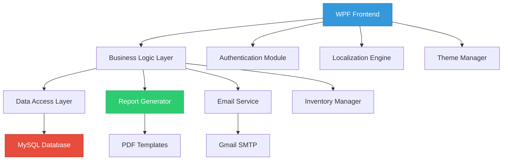

# 🏥 Laboratory Information Management System (LIMS)

*A comprehensive, enterprise-grade Laboratory Information Management System designed specifically for the Al-Qaim Foundation's healthcare operations.*

---

### 🖼️ **System Screenshots**

<!-- Interactive Slideshow -->

<strong>📸 Screenshot Gallery</strong>

[View](https://Najaf-Ali-Imran.github.io/Database-Project-Management-System)

---

## 📋 **Table of Contents**

- [🎯 Overview](#-overview)
- [✨ Key Features](#-key-features)
- [🏗️ System Architecture](#️-system-architecture)
- [🔧 Technology Stack](#-technology-stack)
- [👥 User Portals](#-user-portals)
- [📊 Advanced Features](#-advanced-features)
- [🔒 Security & Compliance](#-security--compliance)
- [🌐 Internationalization](#-internationalization)
- [📈 Reporting & Analytics](#-reporting--analytics)

---

## 🎯 **Overview**

This is a sophisticated, desktop-based Laboratory Information Management System built with cutting-edge WPF technology and C#. This comprehensive solution streamlines laboratory workflows, enhances data accuracy, and provides powerful reporting capabilities tailored specifically for healthcare institutions.

### 🎯 **Mission Statement**
*Empowering healthcare professionals with intelligent laboratory management tools that enhance patient care through accurate, efficient, and secure data management.*

### 🚀 **Key Objectives**
- **Streamline Laboratory Operations** - Reduce manual processes and human error
- **Enhance Data Accuracy** - Implement robust validation and quality controls
- **Improve Reporting Capabilities** - Generate professional, templated reports instantly
- **Optimize Inventory Management** - Track usage, costs, and predict restocking needs
- **Enable Multi-lingual Operations** - Support English and Urdu languages seamlessly

---

## ✨ **Key Features**

| 🔐 **Security** | 🌍 **Accessibility** | 📊 **Analytics** | 🔄 **Automation** |
|:---------------:|:-------------------:|:---------------:|:-----------------:|
| Role-based Access | Dual Language Support | Real-time Dashboards | Automated Reporting |
| BCrypt Encryption | Modern UI/UX | Advanced Charts | Email Integration |
| Secure Authentication | Theme Customization | Usage Analytics | Inventory Tracking |

### 🏆 **Unique Selling Points**

- **🌟 Dual-Language Interface** - Seamless English/Urdu language switching
- **🎨 Multiple Themes** - 5 professionally designed themes for different preferences
- **📧 Automated Email Reports** - MailKit integration with Gmail services
- **📱 Responsive Design** - Modern WPF interface with smooth animations
- **🔄 Real-time Updates** - Live dashboard metrics and notifications
- **📈 Advanced Analytics** - Comprehensive reporting with visual charts

---

## 🏗️ **System Architecture**

---

## 🔧 **Technology Stack**

### **Frontend & UI**
- **Framework**: WPF (Windows Presentation Foundation)
- **Language**: C# (.NET Framework/Core)
- **UI Library**: XAML with custom styling
- **Icons**: FontAwesome.Sharp, MahApps.Metro.IconPacks
- **Charts**: LiveCharts.WPF for data visualization

### **Backend & Data**
- **Database**: MySQL with optimized schema design
- **ORM**: Entity Framework / ADO.NET
- **Security**: BCrypt.Net for password hashing
- **Async Operations**: async/await patterns for responsiveness

### **Reporting & Export**
- **PDF Generation**: QuestPDF with custom templates
- **Excel Export**: EPPlus library
- **CSV Support**: Built-in .NET CSV handling
- **Email Service**: MailKit with Gmail SMTP integration

### **External Integrations**
- **Google Sheets API**: For feedback/issue synchronization
- **Email Services**: Gmail integration for automated reporting
- **File System**: Local file management for notes and temporary data

---

## 👥 **User Portals**

### 🔧 **Administrator Portal**

<strong>📊 Dashboard & Analytics</strong>

- **Real-time Metrics Display**
  - Pending samples and test results
  - Daily completion statistics
  - Patient registration tracking
  - Appointment status overview

- **Visual Analytics**
  - Daily test volume line charts
  - Disease diagnosis pie charts
  - Inventory usage trends
  - Operational performance metrics

- **Task Management**
  - Assigned task tracking
  - Priority-based task sorting
  - Progress monitoring
  - Admin notes functionality

<strong>👤 User & Access Management</strong>

- **User Account Control**
  - Create, edit, delete user accounts
  - Role-based permissions (Admin, Doctor, Lab Technician)
  - Secure password management
  - Email validation and uniqueness checks

- **Access Control**
  - Role-based feature access
  - Permission level management
  - Session management
  - Activity logging

<strong>📦 Inventory Management</strong>

- **Comprehensive Inventory Control**
  - Add, edit, delete inventory items
  - Track quantities, units, expiry dates
  - Supplier and cost management
  - Item categorization

- **Usage Tracking & Analytics**
  - Detailed consumption logs
  - Cost analysis and reporting
  - User-specific usage tracking
  - Automated deduction systems

### 🧪 **Lab Technician Portal**

<strong>🔬 Sample Management</strong>

- **Sample Collection Interface**
  - Patient selection with search functionality
  - Auto-generated unique sample IDs
  - Sample type categorization
  - Collection timestamp recording

- **Inventory Integration**
  - Consumable usage logging
  - Real-time inventory deduction
  - Supply selection interface
  - Transaction-based operations

<strong>📠Test Result Entry</strong>

- **Advanced Result Recording**
  - Progressive component entry
  - Full panel view for simultaneous entry
  - Reference range validation
  - Result flagging system (Normal, Low, High, Critical)

- **Quality Control**
  - Built-in validation rules
  - Component-specific comments
  - Status tracking (Pending, In Progress, Completed)
  - Transaction-based result submission

<strong>📋 Report Generation</strong>

- **Professional Report Creation**
  - Patient-ready test reports
  - Customizable report templates
  - Logo and signature integration
  - Multiple export formats (PDF, Excel, CSV)

---

## 📊 **Advanced Features**

### 🤖 **Automation Capabilities**

- **Automated Email Reporting**
  - Scheduled report delivery
  - Gmail SMTP integration
  - Customizable email templates
  - Attachment management

- **Inventory Management**
  - Automatic stock deduction
  - Low stock alerts
  - Expiry date monitoring
  - Reorder point notifications

- **Task Assignment**
  - Automated task creation
  - Priority-based assignments
  - Deadline tracking
  - Completion notifications

### 📈 **Analytics & Intelligence**

- **Operational Metrics**
  - Real-time dashboard updates
  - Historical trend analysis
  - Performance benchmarking
  - Predictive analytics

- **Usage Analytics**
  - Resource utilization tracking
  - Cost analysis and optimization
  - User productivity metrics
  - System performance monitoring

### 🔄 **Integration Capabilities**

- **Google Sheets Integration**
  - Feedback synchronization
  - Issue tracking import
  - Data validation and processing
  - Duplicate prevention mechanisms

- **External System Support**
  - API-ready architecture
  - Extensible plugin system
  - Third-party service integration
  - Data exchange protocols

---

## 🔒 **Security & Compliance**

### 🛡️ **Security Measures**

- **Authentication & Authorization**
  - Secure login with BCrypt password hashing
  - Role-based access control (RBAC)
  - Session management and timeouts

- **Data Protection**
  - Encrypted password storage
  - Secure database connections
  - Data validation and sanitization
  - Audit trail logging

### 📋 **Compliance Features**

- **Healthcare Standards**
  - HIPAA-compliant data handling
  - Patient privacy protection
  - Secure data transmission
  - Access logging and monitoring

- **Quality Assurance**
  - Data integrity validation
  - Transaction-based operations
  - Backup and recovery procedures
  - Change tracking and versioning

---

## 🌐 **Internationalization**

### 🌍 **Multi-Language Support**

- **Dynamic Language Switching**
  - English and Urdu language support
  - Real-time UI translation
  - Cultural date and number formatting
  - Localized error messages

- **Implementation Details**
  - Resource file-based translations
  - XAML binding for dynamic content
  - Right-to-left (RTL) text support
  - Cultural-specific formatting

---

## 📈 **Reporting & Analytics**

### 📊 **Report Types**

| Report Category | Description | Export Formats |
|:----------------|:------------|:---------------|
| **Inventory Usage** | Detailed consumption tracking with cost analysis | PDF, Excel, CSV |
| **Appointment Management** | Scheduling efficiency and patient flow analysis | PDF, Excel, CSV |
| **Patient Registration** | Demographics and registration trend analysis | PDF, Excel, CSV |
| **Test Results** | Laboratory output and quality metrics | PDF, Excel, CSV |
| **User Activity** | System usage and productivity tracking | PDF, Excel, CSV |

### 🎨 **Professional Templates**

- **PDF Report Templates**
  - Organization branding integration
  - Professional layout design
  - Dynamic content positioning
  - Statistical summary sections

- **Excel Templates**
  - Formatted data presentation
  - Chart integration
  - Conditional formatting
  - Formula-based calculations

---

**Built with ❤️ for the Al-Qaim Foundation**

*Empowering healthcare through intelligent laboratory management*

---
---

**⭐ Star this repository if you find it useful!**

